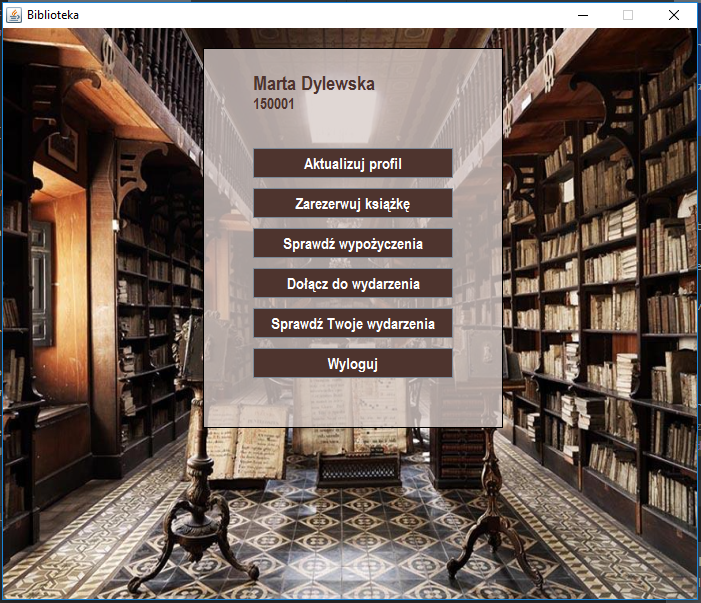
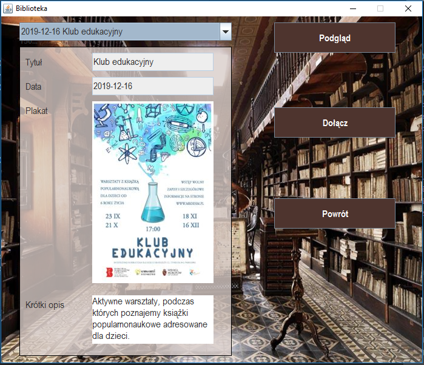
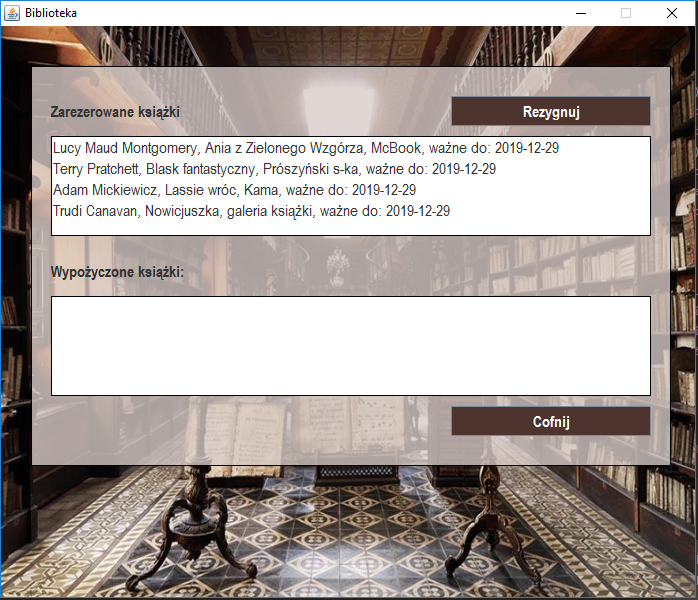
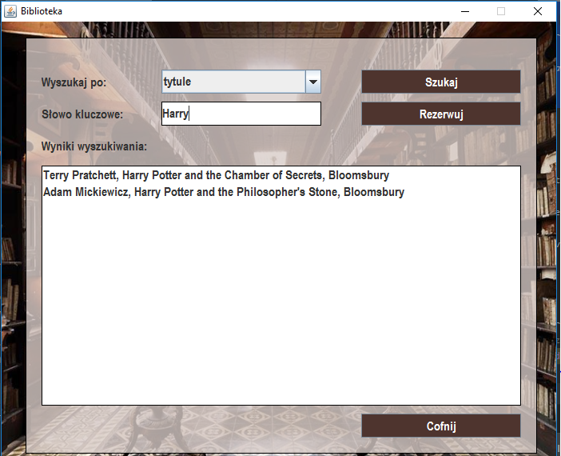
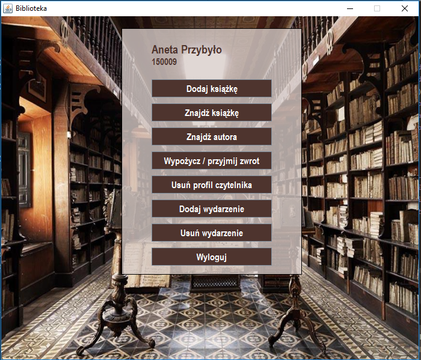
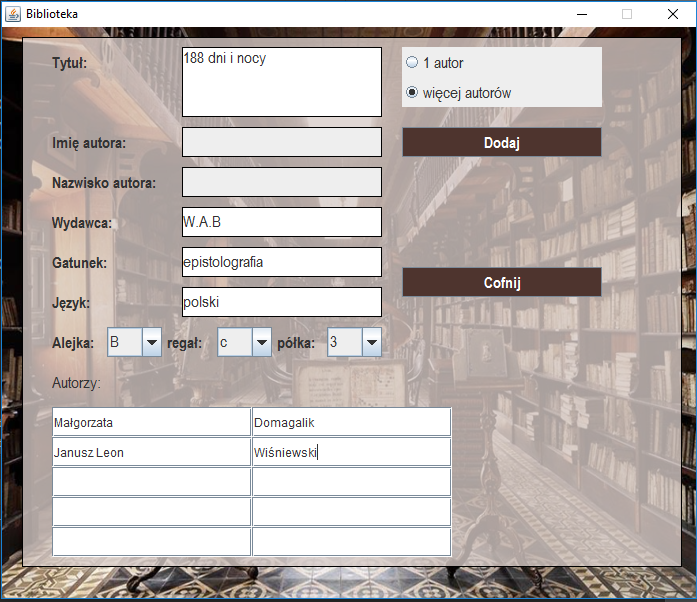
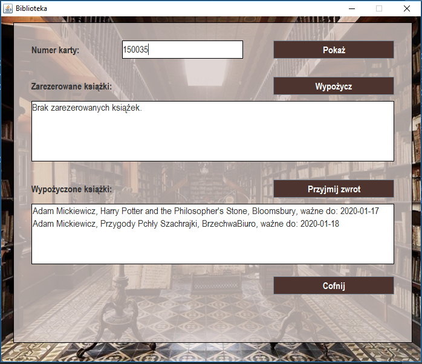
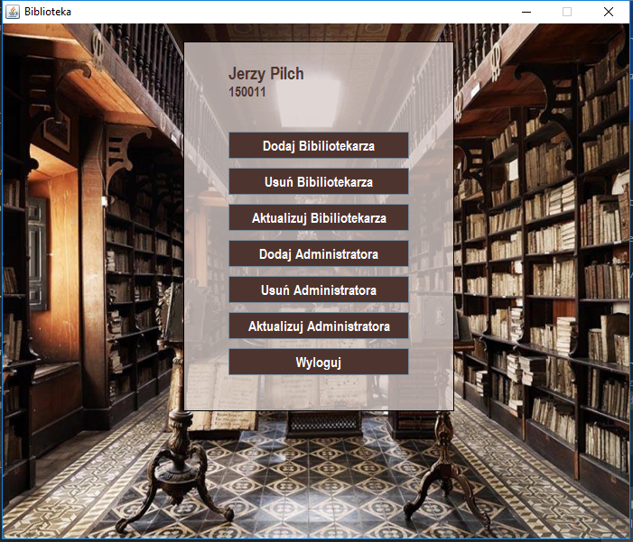
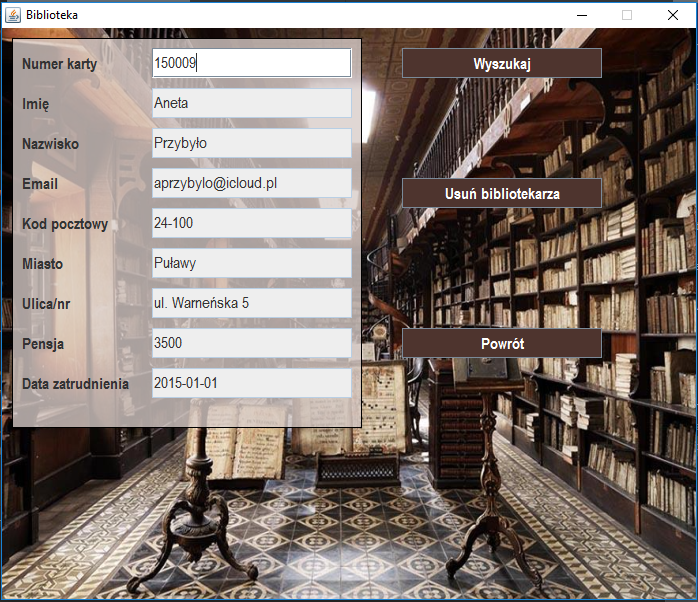

# library
Library management system
- 3 access levels (reader, librarian, administrator)
 - all CRUD operations on entities
 - utilization of jdbc (postgresql) - cooperation with ElephantSQL database

After logging in as a reader, all available options are listed.

Reader can join library's event...

...check his reservations and lendings...

...search for book using different criteria and reserve it.

Librarian interface after logging looks as shown below:

Librarian can add a new book...

... accept return and lend a book from a list of reservations (if number of borrowed books <=3)

Administrator entry panel is shown below: 

Administrator can manage users accounts, for example delete librarian account: 

